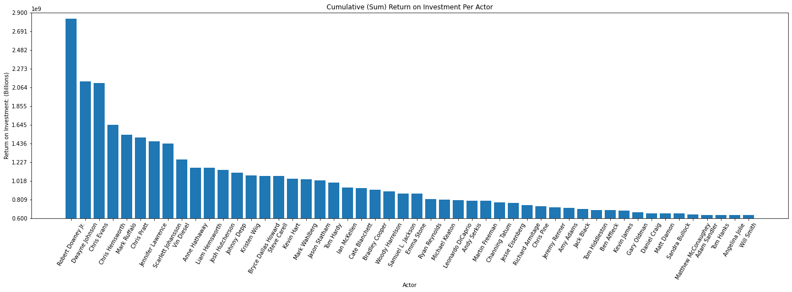

http://localhost:8888/edit/README.md## Title


**Authors**: Freddy Abrahamson

## Overview

The goal of this project is to compare commercial films based on shared traits, such as genre, principal actors/ directors, or release month, in order to determine which types of films are most profitable. The information for this project is derived from several data sets, taken from various reputable movie related websites. I will choose the information I need from these data sets, and import them to pandas. I will clean the data if necessary, and join dataframes to make one large dataframe. I will then use this dataframe to make visualizations that will help give some insights as to which films are most profitable based on return on investment.
## Business Problem

Microsoft has decided to create a new movie studio, but they don’t know anything about creating movies. I am charged with exploring what types of films are currently doing the best at the box office. I must then translate those findings into actionable insights that the head of Microsoft's new movie studio can use to help decide what type of films to create.

To that end I have chosen three major aspects of the films:

1. Genre
2. Principal actors involved.
3. The month of the year the film was released.

I feel comparing these three  will provide actionable insights, based on return on investment,
as well as shedding some light on where further analysis may be warranted. 


## Data


The data comes from 11 different data sets, from several movie related websites, namely:
* imdb.com  (internet movie database)
* tmdb.com  (the movie database)
* rottentomatoes.com
* boxofficemojo.com
* the-numbers.com

Each dataset has different details about the movies including:
* movie budget
* domestic/worldwide gross
* principal cast and crew
* movie ratings
* release dates
* principal's name
* genre
* runtime

They data I chose came from 4 different tables:
1. tn_movie_budgets_csv_gz: Includes movie names, budgets, domestic/worlwide gross, and release dates.
2. imdb_title_basics_csv_gz: Includes runtime, and genre information.
3. imdb_title_principals_csv_gz: Includes unique codes(nconst) that correspond to the name of each                  respective principal cast and crew member, for each movie.
4. imdb_name_basics_csv_gz: Includes the actual cast and crew names that match up with the (nconst) codes. 

These four tables will be joined, to in turn provide insights into what the respective relationships are
between the genre, principal actors, release month, and their return on investment.

## Methods

This project uses descriptive analysis, based on movie statistics taken from an eleven year period from 2010 up to,            and including 2020. I feel this gives a wide enough time frame to amass sufficient data, but does not go so far back 
as to make the data irrelevant.


## Results


### Average Return on Investment Per Genre


Of the 21 total genres, the genres with the highest average yield by far are Sci-fi, Animation, and Adventure. These have an average return on investment of between 124 million dollars, and 132 million dollars. Following these,there is a precipitous drop in the average roi, with a range of 60 million dollars and 88 million dollars. The genres in this range are Action, Fantasy, Family,and Comedy. These 7 genres represent the top third (33.33%) of all the genres. The remaining genres have an average yield of under 50 million dollars.


### Average Return on Investment Per Actor


<br>
Of the total 2703 actors, this chart represents the top 50 actors based on their cumulative return on investment. This in turn represents slightly under 2% of the total actors listed. Robert Downey Jr. stands alone by far, with a cumulative return on investment of over 2.8 billion dollars. His cumulative roi is about one third greater (33.3%) than the following two actors Dwayne Johnson and Chris Evans, who both have a cumulative roi of about 2.1 billion. These three round out the actors with a cumulative roi of 2 billion and above. Immediately following them there are five actors Chris Hemsworth, Mark Ruffalo, Chris Pratt, and Jennifer Lawrence who have a cumulative roi of between 1.4 and 1.6 billion. The remaining actors represented here have a cumulative roi of 1.25 billion or less, with about 75% of those being under 1 billion dollars.


### Average Return on Investment Per Month


May and June both yield an average return on investment of 270 million dollars, which are by far the highest returns. These are followed by July with an average roi of 210 million. These round out the top 3, and the only months with average roi(s) greater than or equal to, 200 million dollars. September is the month with the lowest average roi, at 72 million. It is followed by October and January with average roi(s) of 78 million, and 86 million dollars respectively. The rest of the months have an average roi between 130 and 180 million dollars, with th exception of August, which is considerably lower at about 100 million.


## Conclusions

Based on this analysis, the recommendations to Microsoft for creating a profitable movie are:

* **Given that these movie genres yield the highest average return on investment by far, I highly recommend 
  considering making Sci-fi, Animation and Adventure movies.** Beyond that, at a distant second, but still         offering  a very high return on investment when compared to the rest of the genres, Action, and Fantasy films     are also good options.
  
  
* **When it comes to return on investment, I would most highly recommend the top nineteen actors in this chart      who constitute the very best, of the very best.** Beginning with Robert Downey Jr, Dwayne Johnson, and Chris      Evans,each of whose movies have a cumulative roi of over 2 billion, and continuing down through the list of      nineteen, where all of these actors have played principal roles in movies that in over the last ten years        have yielded a cumulative return on investment of over 1 billion dollars a piece. Beyond that, any of the        actors in the top 50 are very good options. While their cumulative roi is not quite at or above 1 billion,        with the lowest roi in this group being over 600 million, the roi yield of these actors are well within the      98th percentile. 
  
  
* **Concerning the time of release, the months of May and June are the leaders with an average roi of over 270       million, followed by July with an average roi of over 210 million.**  I would most highly recommend releasing     the movies on any of these three months. In addition to this, I would strongly recommend against releasing       movies in the months of September, October, or January, since these represent the months with the                 lowest average roi(s) by a pretty large margin.


## Project Evaluation - Next Steps

This project has served as a great learning experience. It has given me the opportunity to get 
much more familiar with Pandas, as well as practice with data visualizatiions and presentations.
The fact that the project is limited to three observations, is an inherent limitation, since                 there are usually more factors that need to be taken into consideration to make a more accurate           analysis. This combined with my limited knowledge of the math used in data-science, and how it
is applied, considerably limits the insights I could share. A few of further steps that could be taken
in order to give a more insightful analysis would be:

1. Create a type of index for the genres, that would take into consideration not only their avearge roi,
   but the frequency with which films in that genre were made.
2. Checking to see if there is a uniformity with regards to how many films of each genre were made each month.      If this is not the case, then the average roi on a particular month is more likely to be a manifestation
   of other factors.
3. Looking into movie directors, and possible actor/director combinations. 


## For More Information

Please review my full analysis in [my Jupyter Notebook](./student.ipynb) or my[presentation](./DS_Project_Presentation.pdf).

For any additional questions, please contact **Freddy Abrahamson at fred0421@hotmail.com**

## Repository Structure

Describe the structure of your repository and its contents, for example:

```
├── README.md                           <- The top-level README for reviewers of this project
├── student.ipynb                       <- Narrative documentation of analysis in Jupyter notebook
├── DS_Project_Presentation.pdf         <- PDF version of project presentation
├── zippedData                          <- Both sourced externally and generated from code
└── images                              <- Both sourced externally and generated from code
```
